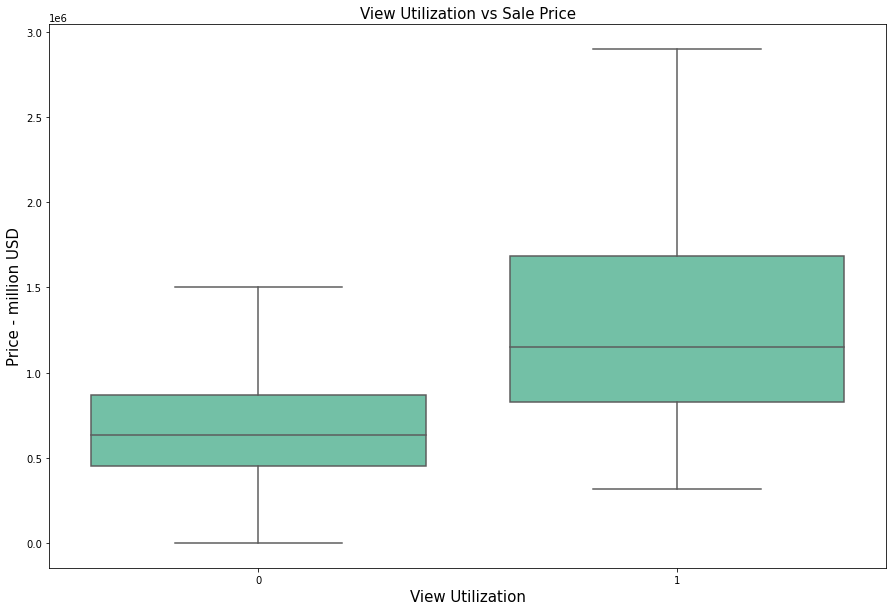
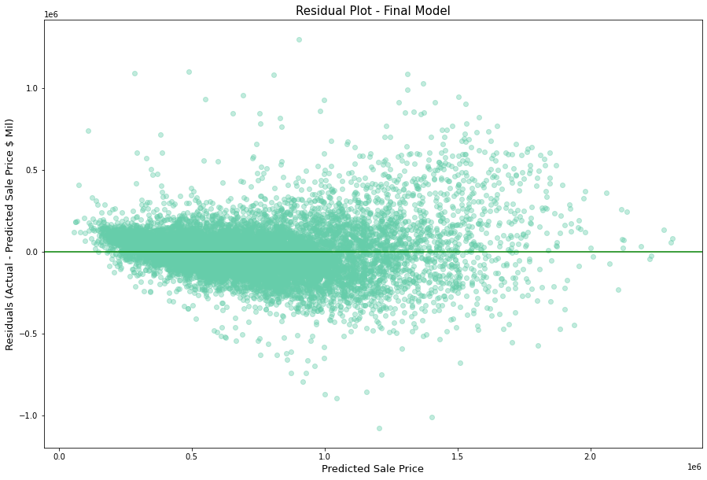

# King County Home Price Analysis

This repository offers an analysis of factors that influence housing prices in King County, WA

## This Repository

### Repository Directory

```
├── README.md        <-- Main README file explaining the project's business case,
│                        methodology, and findings
│
├── data             <-- Data in CSV format
│   ├── processed    <-- Processed (combined, cleaned) data used for modeling
│   └── raw          <-- Original (immutable) data dump
│
├── notebooks        <-- Jupyter Notebooks for exploration and presentation
│   ├── exploratory  <-- Unpolished exploratory data analysis (EDA) notebooks
│   └── report       <-- Polished final notebook(s)
│
├── references       <-- Data dictionaries, manuals, and project instructions
│
└── reports          <-- Generated analysis (including presentation.pdf)
    └── figures      <-- Generated graphics and figures to be used in reporting
```

### Quick Links

1. [Final Analysis Notebook](notebooks/report/modelling.ipynb)
2. [Presentation Slides](reports/presentation.pdf)

### Setup Instructions

To run these notebooks independently, I have provided the [environment.yml](environment.yml) to clone to geo-env environment which contains all dependencies.

## Scope of Project

The purpose of this study is to undergo an inferential modeling workflow with the aim of determining which home improvements could have positive impacts on the sale value of a home.

This project will focus on single family households and homes sold in 2019 - non residential property is outside of the scope.

Data has been provided from [King County GIS Center](https://www.kingcounty.gov/gis) and the raw files are [here](data/raw/provided)

## Data Understanding

King County is the most expensive County in Washington and home to some of the most expensive homes in the United States.
Within King County there is a big variation in property prices, but as can be seen from the map which represents each Zip Code in Washington and its average house price, the most expensive (dark red) are near Bellevue, Mercer Island and Medina. Like everywhere else in the world, location matters..I will create a feature that defines the minimum distance to 4 expensive areas in King County.


Not only does location matter, there is a strong linear relationship with Building Grade too, this could be an important feature in the workflow.


So building grade impacts price, but so does the view. View utilization which seems an intangible metric but it pays...homes with a view have a nice premium associated with them. This could be an important feature



Square Footage can have interesting relationships with home prices, given the trade off of location vs space. However in the case of King County, it appears there is a positive linear relation with square footage total living area.


## Data Preparation

For detailed walk through of this, please refer to the [cleaning notebook](notebooks/report/final_cleaning.ipynb). There were many columns that were either blank, had many NaNs, or were filled with only one value for example 'N'. I tried to keep as many columns as possible until the first pass of the modeling phase as I did not want to discount something which could be important. 

## Modeling

The final model that was selected for recommendations had 119 features, many of which were dummies including Zip Code which makes up the majority of features. Most of the features are significant, however, I have not gone through the process of removing variables purely for insignificance. I have check for multicollinearity and tried to reduce that as much as possible using variable inflation factor.

The model has an R-Squared of 83.5 meaning it explains 83.5% of the variance in Sale Price. There are some areas that are worse than others in terms of error, meaning homoscedasticity hasn't been fully honoured despite efforts.

The model struggles towards the more expensive end of the sales prices, as can be seen from the residuals plot.




## Evaluation

Despite best efforts, the residuals plot shows the homoscedasticity assumption isn't honoured as well as it could be, the normality of residuals also isn't as good as I would like. As can be seen by the table, I did refine this model further (7b), eliminating features with high VIF numbers. This reduced the JB number slightly but R-Squared suffered. 


## Conclusion

The following recommendations could be made based on the findings from the model


#### Increase Living Space

For every one square foot of total living space you add to a property, its price will increase by 119 USD assuming all other variables are kept constant. i.e if you add 500 square feet of living space this could add up to 60,000USD to the price. This is not an improvement that would be available in every property. 


#### Add Bathroom

The bedbath feature was simply bedroom count subracting bathroom count. As this approaches zero or better still goes negative  (i.e you have equal number of bathrooms to bedrooms or more bathrooms than bedrooms) the Sale Price improves. If you improve this ratio by one i.e add one total bathroom this will increase the house price by 29420 USD if all other variables are held constant.

#### Renovation 

Renovating a house can me expensive but it can be worth it. The coefficient of the renovation feature is 58,220USD. Meaning if you renovate the house on average it will increase the house price by 58,220USD.

#### Install Porch

The interpretation of the coefficient for having a porch suggests having a porch will increase the price of your property by 17,560USD. 

#### Improve general condition

This is a slightly ambiguous feature, however it is assumed this means the general condition of the property. The difference here is stark though, assuming all other variables are kept the same, a 'good' condition home will sell for 33,950USD more than an 'average' condition property. for 'very good' this is even more - 70,980USD. 

#### Fix Issues

Assuming all other variables are kept the same, a home with a water issue or some other unspecified will be worth 18,960USD less than a home that is issue free.

## Further Work

As has already been established the model struggled with some of the higher value properties. I mapped the 200 worst offenders (biggest difference between predicted and actual), to check I wasn't missing one particularly desirable zone. It turned out as they were quite well spread out although from the map it is clear many of them are very close to water. It would be useful to engineer a feature that establishes the minimum distance to a water body. Example below is a property right on Lake Sammahish which is undervalued in the model.


Other features I would like to explore with time is proximity to good transport links, average commuting time to downtown Seattle and proximity to good schools.

